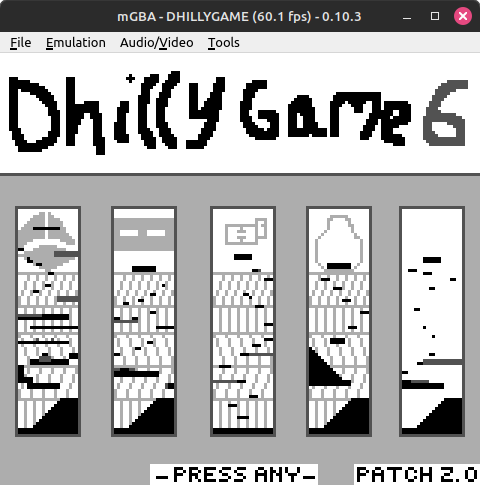
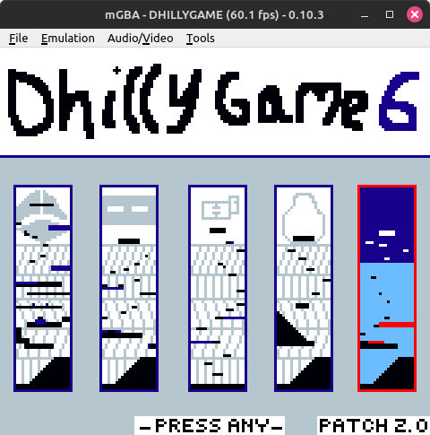
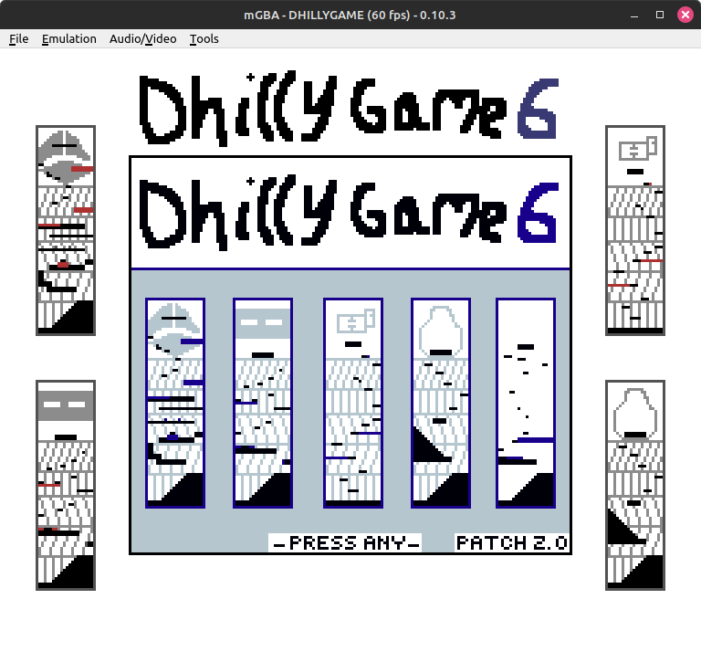
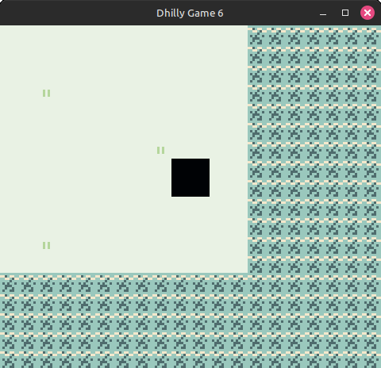

# Dhilly Game 6 Remake
Dhilly Game 6 is a homebrew Game Boy Color game made with GB Studio 3.1. The source code is missing, yet many changes are asked of the devs. I, Eve (Also known as "LenEnjoyer" and "MS3"), am going to remake this game, potentially with help from my friends. The remake will include:
- More polish
- Bonus content
- Better graphics
- Bug fixes
- Multiplayer via link cable (Will work wirelessly on the Nintendo 3DS Virtual Console release, if emulating, check your favourite emulator for link cable emulation support)
- Compatibility with Game Boy hardware (Previous only worked with Game Boy Color hardware)
- Super Game Boy (SNES) enhancements (Border and preset palettes)
- **Difficulty balencing**

Please edit the .gbsproj file with GB Studio 3.2. Yes, Stanley this means you need to update your GB Studio version. I intend on switching to GB Studio 4.0 when it is in stable release.

**Running on Game Boy**

**Running on Game Boy Color**

**Running on Super Game Boy** (A cartridge for the SNES that plays Game Boy games)

